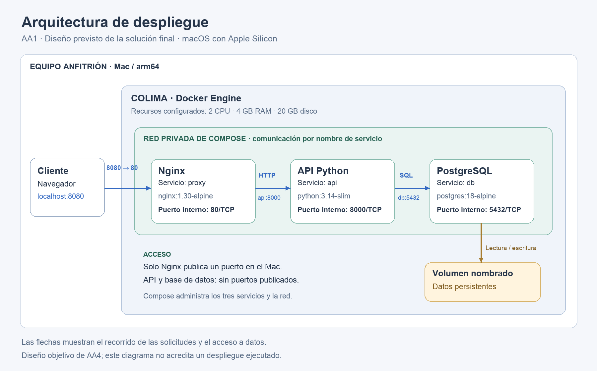

# Taller Docker: API, PostgreSQL y Nginx

Proyecto del taller **Despliegue de aplicaciones y servicios en contenedores Docker**, guía SENA GFPI-F-135. Una API en Python consulta PostgreSQL y recibe solicitudes a través de Nginx. Docker Compose inicia los tres servicios con un comando.

Las instrucciones de este repositorio están enfocadas en **macOS con Apple Silicon y Colima**, el entorno utilizado en el taller.

## Arquitectura



El cliente accede a `http://localhost:8080`. Nginx reenvía la solicitud a `api:8000` y la API consulta `db:5432`. Solo Nginx publica un puerto en el Mac. PostgreSQL guarda los datos en un volumen nombrado.

| Ruta | Respuesta esperada |
|---|---|
| `/health` | HTTP 200 y `{"status":"ok"}` cuando la API responde. |
| `/db` | HTTP 200 con el nombre de la base de datos y su hora actual. Devuelve HTTP 503 si falta la contraseña o falla la consulta. |

`/health` comprueba la disponibilidad de la API; `/db` comprueba además su conexión con PostgreSQL.

## Requisitos

- macOS 13 o superior y procesador Apple Silicon.
- Mínimos de la guía: 4 GB de RAM y 15 GB de disco libre; se recomiendan 8 GB de RAM y 25 GB libres. Colima se configura con 2 CPU, 4 GB de RAM y 20 GB de disco virtual.
- Conexión a internet para descargar herramientas, imágenes y dependencias.
- Git, Docker CLI, Compose y Colima.
- Puerto local 8080 disponible.

Los datos y las versiones comprobadas del equipo están en [docs/entorno.md](docs/entorno.md).

## Preparar Docker en el Mac

Si las herramientas ya están instaladas y funcionan, continúa con la clonación.

1. Instala Homebrew siguiendo las instrucciones de su [sitio oficial](https://brew.sh/) y completa los pasos que muestre para habilitar `brew` en la terminal.
2. Instala las herramientas:

   ```bash
   brew install git docker docker-compose docker-buildx colima
   ```

3. Verifica los plugins:

   ```bash
   docker compose version
   docker buildx version
   ```

   Si Docker no encuentra los plugins, crea la carpeta de configuración:

   ```bash
   mkdir -p ~/.docker
   ```

   En `~/.docker/config.json`, agrega la propiedad siguiente conservando las demás propiedades existentes. Si el archivo no existe, créalo con este contenido:

   ```json
   {
     "cliPluginsExtraDirs": ["/opt/homebrew/lib/docker/cli-plugins"]
   }
   ```

   La ruta corresponde a la instalación habitual de Homebrew en Apple Silicon; `brew --prefix` permite comprobar su prefijo. Repite las verificaciones de los plugins. Referencias: [Colima](https://colima.run/docs/installation/) y [Compose en Homebrew](https://formulae.brew.sh/formula/docker-compose).

4. Inicia el motor y compruébalo:

   ```bash
   colima start --cpu 2 --memory 4 --disk 20
   colima status
   docker info
   docker run --rm hello-world
   ```

   Espera `Hello from Docker!`. Al volver a encender el Mac, usa `colima start` si el motor está detenido.

## Instalar y ejecutar el proyecto

### 1. Clonar

Desde una carpeta donde quieras guardar el proyecto:

```bash
git clone https://github.com/Juanpvivas/tallerDocker.git
cd tallerDocker
```

Si ya tienes esta copia del repositorio, entra en ella en lugar de volver a clonarla. Ejecuta los comandos siguientes en la carpeta que contiene `docker-compose.yml`.

### 2. Configurar

En una copia nueva:

```bash
cp .env.example .env
```

Abre `.env` en tu editor, conserva `DB_NAME=appdb` y `DB_USER=postgres`, y reemplaza el valor ficticio de `DB_PASSWORD` por una contraseña para la práctica. `.env` está excluido de Git y del contexto de construcción. La imagen no necesita incluirlo.

Si ya tienes `.env`, edítalo sin reemplazarlo con el archivo de ejemplo. Cambiar su contraseña después de inicializar PostgreSQL no cambia automáticamente la contraseña guardada en la base existente.

### 3. Validar e iniciar

```bash
docker compose config --quiet
docker compose up -d --build
docker compose ps
```

La validación debe terminar sin errores. Espera que `db` y `api` indiquen `healthy` y que `proxy` esté en ejecución. Los nombres concretos de los contenedores dependen de la carpeta o del nombre de proyecto de Compose; usa los nombres de servicio `db`, `api` y `proxy` en los comandos.

### 4. Probar

```bash
curl -i http://localhost:8080/health
curl -i http://localhost:8080/db
```

Ambas rutas deben devolver HTTP 200. También puedes abrir [la documentación interactiva de la API](http://localhost:8080/docs). No hay una página de inicio en `/`; una respuesta 404 allí no invalida las pruebas de las rutas anteriores.

## Operación diaria

| Acción | Comando |
|---|---|
| Ver servicios | `docker compose ps` |
| Ver registros recientes | `docker compose logs --tail 50` |
| Seguir registros de la API | `docker compose logs -f api` (Ctrl+C termina la visualización) |
| Detener contenedores conservándolos | `docker compose stop` |
| Iniciar servicios | `docker compose up -d` |
| Reconstruir después de cambiar el código | `docker compose up -d --build` |
| Eliminar contenedores y red conservando el volumen | `docker compose down` |

**`docker compose down -v` elimina también los datos del volumen.** No se utiliza en la prueba de persistencia ni en el procedimiento habitual de reinicio.

## Publicación automática

El flujo [Publicar imagen](.github/workflows/publicar-imagen.yml) se ejecuta al subir cambios a `main`, al publicar una etiqueta Git `v*.*.*` o al iniciarlo manualmente. Construye para `linux/arm64`, publica en GHCR y reutiliza caché. Utiliza `GITHUB_TOKEN` con permiso `packages: write`.

- Registry: `ghcr.io/juanpvivas/tallerdocker`.
- Etiquetas: `latest`, `sha-<commit>` y versiones semánticas cuando corresponda.
- Resultados: [Actions del repositorio](https://github.com/Juanpvivas/tallerDocker/actions).
- Un paquete existente debe permitir acceso al repositorio en **Package settings → Manage Actions access**, con rol **Write**.

Para descargar la versión automática que fue verificada durante el taller:

```bash
docker pull ghcr.io/juanpvivas/tallerdocker:sha-62ea4a9
```

Si el paquete es privado, inicia sesión antes con `docker login ghcr.io -u TU_USUARIO` y un token clásico con acceso de lectura al paquete. No compartas el token en archivos ni en registros.

El flujo publica imágenes; no incluye pruebas funcionales ni despliegue automático. El Compose local construye desde el código y no utiliza automáticamente las imágenes descargadas de GHCR. Consulta [despliegue-automatizado.md](docs/despliegue-automatizado.md) para la propuesta de despliegue y reversión por digest.

## Documentación y estado del taller

| Documento | Contenido |
|---|---|
| [Requisitos](docs/requisitos.md) | Matriz y criterios de aceptación. |
| [Entorno](docs/entorno.md) | Configuración del Mac y verificaciones. |
| [Imágenes](docs/imagenes.md) | Tamaños, comparación de etapas y publicaciones en GHCR. |
| [Pruebas](docs/pruebas.md) | Integración, persistencia, aislamiento y copia limpia. |
| [Despliegue automatizado](docs/despliegue-automatizado.md) | Evidencias de Actions y propuesta de despliegue al servidor. |
| [Manual técnico](docs/manual-tecnico.md) | Configuración, operación, diagnóstico y propuesta de escalamiento. |

Se verificaron el despliegue local desde una copia de GitHub, persistencia, comunicación por nombre y aislamiento del puerto de PostgreSQL. Se completaron dos publicaciones automáticas exitosas y una descarga con digest coincidente. Son evidencias del 5 de octubre de 2026, no una afirmación sobre el estado actual de los servicios.

Quedan por completar la entrega al aula, la release solicitada, el video y el despliegue remoto según el alcance acordado con el instructor. La propuesta de escalamiento está documentada; su implementación no se ha realizado.
